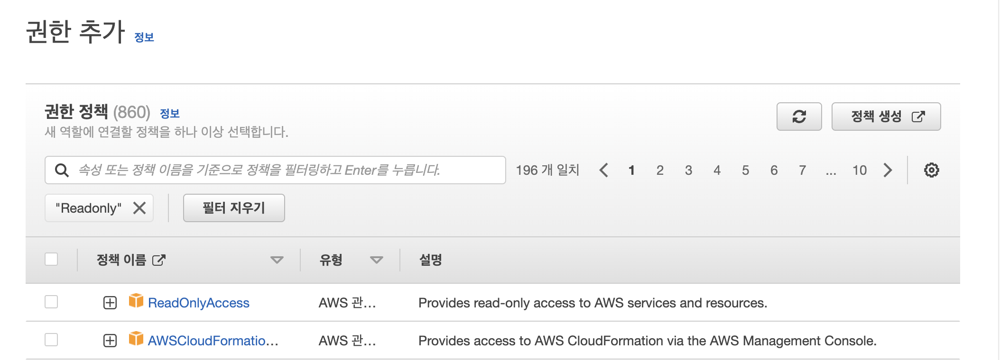

## [AWS] IAM

## IAM이란?
IAM : Identity and Access Management  
쉽게 말하면, **IAM은 유저를 관리하고 접근 레벨 및 권한을 관리하는 것이다.**  

- 유저에게는 접근키(Access Key)와 비밀키(Secret Access Key)가 주어진다. 이것은 로그인할 때 쓰는 비밀번호가 아님
- 매우 세밀한 접근 권한 부여가 가능
- 비밀번호를 수시로 변경하게 함(보안성 증가)
- 다중 인증 기능(Multi-Factor Authentication)
- 지역 설정이 필요 없음
- IAM에는 (그룹 / 유저 / 역할 / 정책) 이 존재한다

## 역할과 정책의 차이
그룹과 유저를 이해하는건 어렵지 않았는데, **역할과 정책의 차이**가 조금 헷갈렸다. 처음에는 "역할이나 정책은 그룹이나 유저에게 권한을 부여하는거 아닌가? 뭐가 다른거지?" 라고 생각했는데, 역할은 유저나 그룹에게 권한을 부여할 수 없다.  
역할은 사용자 계정에 연결하는 것이 아니라 AWS서비스에 연결하는 것이다. 예를 들어 

